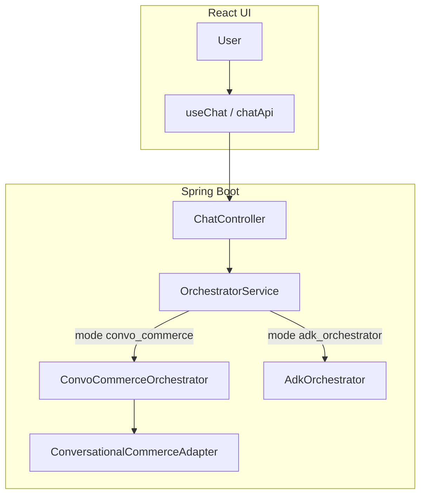

# User flow and services

This document ties **what the shopper does in the UI** to **which backend components run** and **which Google Cloud (or Gemini) APIs are called**. For field-level HTTP details, see [frontend-and-chat-api.md](frontend-and-chat-api.md). For the two-step Retail pattern in depth, see [product-search-and-retail-apis.md](product-search-and-retail-apis.md).

---

## 1. Common path: browser to backend

Every interaction follows the same entry path:

1. The user acts in **React** (`ChatInterface`, `MessageList`, `useChat`).
2. **`useChat`** builds a **`ChatRequest`** and calls **`POST /api/chat`** (see `frontend/src/api/chatApi.ts`; Vite proxies `/api` to Spring Boot in development).
3. **`ChatController`** validates the body and calls **`OrchestratorService.process(...)`**.
4. **`OrchestratorService`** switches on **`mode`**:
   - **`convo_commerce`** → **`ConvoCommerceOrchestrator`** → **`ConversationalCommerceAdapter`**
   - **`adk_orchestrator`** → **`AdkOrchestrator`** (Gemini / ADK + tools)
5. The result is mapped to **`ChatResponse`** JSON (text, products, chips, pagination, optional `rawResponse`, etc.).

---

## 2. User-visible flows (what happens in the UI)

| User action | Typical `ChatRequest` fields | Backend highlight |
|-------------|------------------------------|-------------------|
| **Types a message and sends** | `message`, `mode`, `conversationId`, `sessionId`, optional context fields | Full turn through the active orchestrator (below). |
| **Clicks a suggested-answer chip** | `message` = chip **value** (e.g. storage code), `previousAssistantText`, `previousSuggestedAnswers`, `previousRefinedQuery`, `previousProductFilter` as needed | Same as a normal turn; adapter or VAISR resolver uses prior context for filters, recovery, and re-asks. |
| **Clicks Load more** | `productPageToken`, `previousRefinedQuery`, `previousProductFilter`, `productPageSize` | **`ConversationalCommerceAdapter`** short-circuits conversational search and calls **`RetailSearchClient.searchWithPagination`** only (see [product-search-and-retail-apis.md](product-search-and-retail-apis.md)). **ADK mode** normally does not drive load-more the same way; use **convo_commerce** for pagination unless you extend the ADK path. |
| **Attaches an image** | `imageBase64` (+ optional text) | **Conversational** request includes image; product listing still comes from **Retail Search** when a refined query is available. |
| **Uses voice** | Same as text after the browser transcribes speech to a string | No separate backend “voice service”; it is a text message. Chrome-only UX: [frontend-and-chat-api.md](frontend-and-chat-api.md). |
| **Get more suggestions** (if exposed) | Depends on implementation; may repeat or extend conversational context | Usually another conversational turn or client-driven cap change. |

The UI also **suppresses redundant storage chips** after product results and honors an **explicit empty** `suggestedAnswers` list (so stale facets are not re-read from `rawResponse`). See [frontend-and-chat-api.md](frontend-and-chat-api.md) and `useChat.ts`.

---

## 3. Mode: `convo_commerce` (Approach A) — services per turn

**Orchestrator:** `ConvoCommerceOrchestrator` → **`ConversationalCommerceAdapter.sendMessage`**.

**Typical new turn** (not “load more”, not in-memory pool refine):

| Step | What runs | Google Cloud / external |
|------|-----------|-------------------------|
| 1 | Build **`ConversationalCommerceRequest`** (placement, branch, query, visitor id, conversation id, optional image). | |
| 2 | **`ConversationalCommerceClient.search`** | **Retail `conversationalSearch`** on your placement (REST or gRPC per config). |
| 3 | Parse **`refinedQuery`**, **`conversationId`**, **`queryType`**, **`suggestedAnswers`**, assistant text, **`rawResponse`**. | |
| 4 | If a retail search should run: **`RetailSearchClient`** (`search` / `searchWithPagination`) with optional **filter** (brands, stock/storage, session merge). | **Retail Search API** (product listing on the branch). |
| 5 | Optionally **`ProductEnrichmentService`** | **`Product.get`** (REST) when transport and product `name` allow enrichment. |
| 6 | Optionally **`VertexAiRankingService`** | **Vertex AI** ranking API when configured (`VertexAiRankingConfig`). |
| 7 | Adapter applies policies (clarifying follow-up, storage recovery, pagination metadata, stripping echoed storage chips when products are returned, etc.). | |

**Load more:** step 2 is skipped; only **Retail Search** pagination is called with the stored query, filter, and page token.

**In-memory pool refine** (`productPool` in context): conversational commerce may narrow an existing product list without a full catalog listing step; see **`ProductPoolNarrower`** in the adapter.

**Gemini in this mode:** the adapter’s **Gemini clarifying** branch is tied to **`orchestrationMode`** in context; with the default wiring, **Approach A** sets **`convo_commerce`**, so **Gemini is not** the primary router here. Shopping behavior is **Conversational Commerce + Retail Search** as above.

---

## 4. Mode: `adk_orchestrator` (Approach B) — services per turn

**Orchestrator:** **`AdkOrchestrator`** using an ADK **`LlmAgent`** and **`InMemoryRunner`**.

| Step | What runs | Google Cloud / external |
|------|-----------|-------------------------|
| 1 | **Gemini (via ADK / Gen AI SDK)** consumes the user message and session. | **Generative Language** / Vertex (per **`AdkConfig`** and API key / ADC). |
| 2 | The model may call **`ConversationalCommerceTool.searchProducts`** (function tool). | That tool calls **`ConversationalCommerceClient.search`** → **Retail `conversationalSearch`** (same as Approach A step 2). |
| 3 | Tool result is returned to the model; **`AdkVaisrSessionBridge`** maps **ADK session id** ↔ **GCP `conversationId`** so the tool can pass **VAISR** continuity on the next `searchProducts` call. | In-memory map in the app (not a GCP API). |
| 4 | After the run, **`VaisrRetailProductResolver.resolve`** turns the last successful tool payload into products: **Retail Search**, recovery logic parallel to the adapter (storage / no-preference paths), and optional **`ClarifyingQuestionGenerator` (Gemini)** for generated clarifying copy when product counts exceed thresholds. | **Retail Search API**; optional **Gemini** for clarifying text. |
| 5 | **`AdkOrchestrator`** merges model text, tool errors, **`suggestedAnswers`**, and applies policies (e.g. drop echoed **storage** suggestions when product hits exist). | |

Other ADK tools (loyalty, recommendations, etc., if configured on the agent) follow the same pattern: **model decides** → **tool executes** → **response merged** into **`AgentResponse`**.

If **no Gemini API key / ADC** is available, **`AdkOrchestrator`** returns a **placeholder** telling you to configure **`GOOGLE_API_KEY`** or Vertex project credentials.

---

## 5. Quick reference: “who calls what”

| Goal | Primary caller | Primary GCP / model API |
|------|----------------|-------------------------|
| Multi-turn intent, refined query, chips | `ConversationalCommerceClient` | Retail **conversationalSearch** |
| Product grid, filters, pagination | `RetailSearchClient` implementations | Retail **Search** (products) |
| Richer product cards | `ProductEnrichmentService` | Retail **Product.get** (when enabled) |
| Rerank search hits | `VertexAiRankingService` | Vertex AI (optional) |
| Route shopping + tools + natural reply | `AdkOrchestrator` + `LlmAgent` | **Gemini** (ADK) |
| VAISR conversation id continuity in ADK | `AdkVaisrSessionBridge` | — (application state) |

---

## 6. Related documentation

| Document | Use |
|----------|-----|
| [system-overview.md](system-overview.md) | Diagram and layer summary |
| [product-search-and-retail-apis.md](product-search-and-retail-apis.md) | Conversational vs product search, REST/gRPC, Product.get |
| [orchestration-and-modes.md](orchestration-and-modes.md) | Class-level mode wiring |
| [frontend-and-chat-api.md](frontend-and-chat-api.md) | Request/response fields and UI behavior |
| [CONFIG.md](../CONFIG.md) | Credentials, placement, branch |
| [CODE.md](../CODE.md) | Package layout and DTOs |

Suggested reading order for new contributors: **system-overview** → **this page** → **product-search-and-retail-apis** → **frontend-and-chat-api**.
